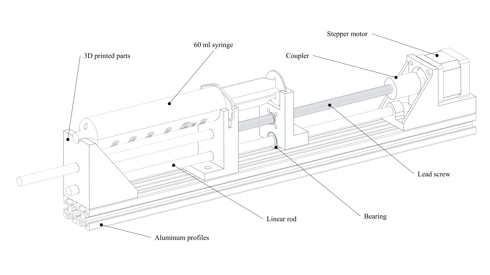

# Open-Source-Syringe-Pump
Here is an open source and low cost syringe pump project for soft robotic and micro-fluidic applications.

Bill of Materials;
- 20*20 Aluminum profiles (x2)
- Lead screw T8, 8mm, 400mm (x1)
- Linear rod 8mm, 350mm (x1)
- 60 ml syringe (x1)
- LM8UU bearing (x1)
- Coupler 5*8 (x1)
- T nut and bolt M5 (x6 each)
- M3 bolts for motor and lead screw nut mounting (x8)
- Stepper motor Nema14 (x1)
- Arduino Uno (x1)
- Motor driver, A4988 (x1)
- Power supply (x1)
- Capacitor 2200 uF (x1)
- 3D printed parts (x4)

Electronics Wiring;

Design Overview;

Youtube Video;
